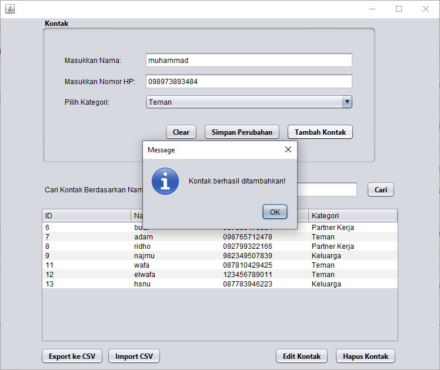
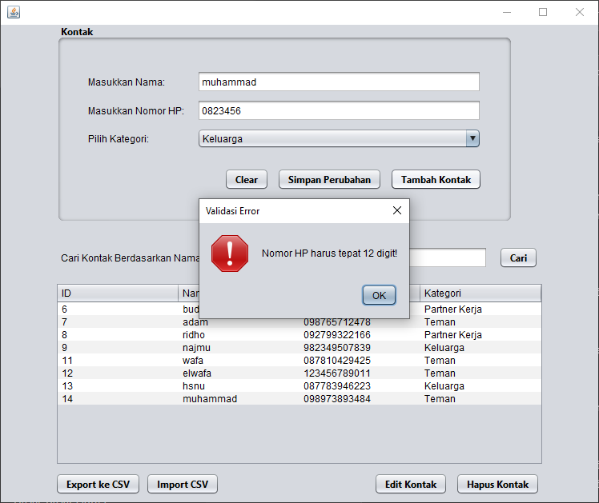
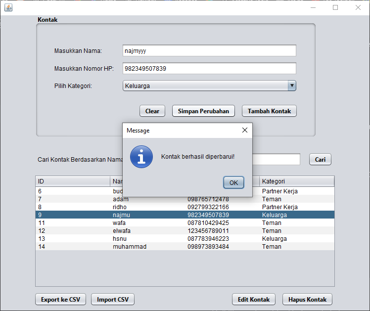
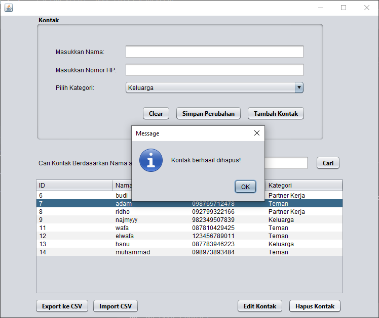
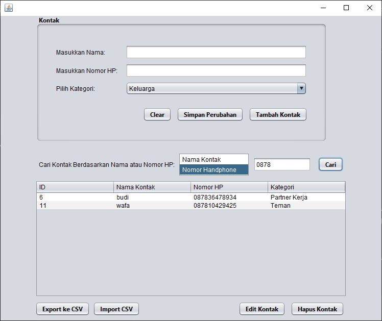
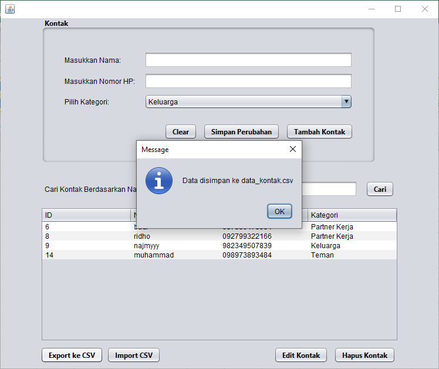
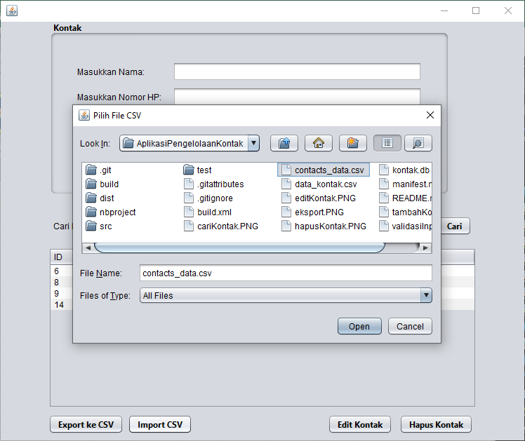
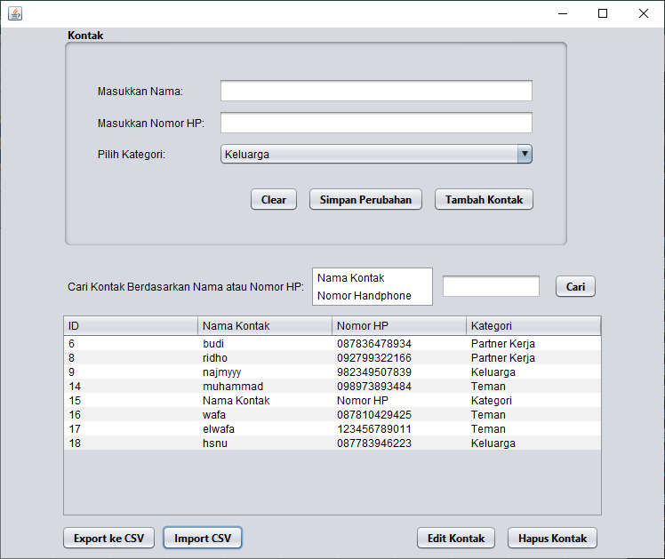

# Aplikasi Pengelolaan Kontak

Aplikasi Pengelolaan Kontak adalah aplikasi berbasis Java yang dirancang untuk mempermudah pengelolaan data kontak. Aplikasi ini dibangun menggunakan Java Swing sebagai antarmuka pengguna (GUI) dan SQLite sebagai database. Dengan aplikasi ini, pengguna dapat menambah, mengedit, menghapus, mencari, dan menyimpan data kontak ke dalam file `.csv`.

## Fitur Utama

1. **Tambah Kontak**
   - Pengguna dapat menambahkan kontak baru dengan mengisi:
     - Nama kontak
     - Nomor handphone (12 digit angka)
     - Kategori kontak (Keluarga, Teman, atau Partner Kerja)
   - Data yang ditambahkan akan langsung disimpan ke dalam database SQLite dan ditampilkan di tabel.

2. **Validasi Input**
   - Nomor telepon harus berisi **tepat 12 digit angka**.
   - Jika input tidak valid, pengguna akan diberi peringatan.

3. **Edit Kontak**
   - Pengguna dapat mengedit data kontak dengan memilih baris di tabel, memodifikasi data, dan menyimpannya kembali.
   - Perubahan akan langsung diperbarui di database dan tabel.

4. **Hapus Kontak**
   - Pengguna dapat menghapus kontak dengan memilih baris di tabel dan menekan tombol **Hapus Kontak**.
   - Validasi akan meminta konfirmasi sebelum kontak dihapus.

5. **Pencarian Kontak**
   - Pengguna dapat mencari kontak berdasarkan:
     - Nama kontak
     - Nomor handphone
   - Hasil pencarian akan ditampilkan langsung di tabel.

6. **Ekspor dan Impor File CSV**
   - Data kontak dapat diekspor ke file `.csv` untuk penyimpanan eksternal.
   - Pengguna juga dapat mengimpor file `.csv` untuk menambahkan data kontak baru ke tabel.

7. **Reset Input**
   - Fitur ini memungkinkan pengguna untuk mengosongkan semua input dengan satu klik.

## Teknologi yang Digunakan

- **Bahasa Pemrograman**: Java
- **Framework GUI**: Java Swing
- **Database**: SQLite

## Cara Menggunakan

1. **Persiapan Database**
   - Pastikan Anda memiliki SQLite terinstal.
   - Buat file database bernama `kontak.db` jika belum ada.
   - Buat tabel `kontak` dengan perintah berikut:
     ```sql
     CREATE TABLE kontak (
         id INTEGER PRIMARY KEY AUTOINCREMENT,
         nama TEXT NOT NULL,
         nomor_hp TEXT NOT NULL,
         kategori TEXT NOT NULL
     );
     ```

2. **Menjalankan Aplikasi**
   - Clone repository ini atau salin source code ke IDE Anda (NetBeans, IntelliJ, dsb.).
   - Pastikan file `kontak.db` berada di lokasi yang sesuai.
   - Jalankan file `PengelolaKontakFrame.java` untuk membuka aplikasi.

3. **Menambah Data**
   - Isi nama, nomor HP, dan kategori kontak.
   - Klik tombol **Tambah Kontak** untuk menyimpan data ke tabel dan database.

4. **Mengedit Data**
   - Pilih baris yang ingin diedit di tabel.
   - Modifikasi input, lalu klik **Simpan Perubahan**.

5. **Menghapus Data**
   - Pilih baris yang ingin dihapus di tabel.
   - Klik tombol **Hapus Kontak** dan konfirmasi penghapusan.

6. **Mencari Data**
   - Pilih metode pencarian (Nama atau Nomor HP) dari daftar.
   - Masukkan data yang ingin dicari dan klik tombol **Cari**.

7. **Ekspor dan Impor CSV**
   - Klik tombol **Ekspor CSV** untuk menyimpan data ke file `.csv`.
   - Klik tombol **Impor CSV** untuk menambahkan data dari file `.csv`.

## Tampilan Aplikasi

- ### menambahkan kontak baru
  

- ### Memvalidasi inputan nomor handphone
  
  
- ### Mengedit data kontak
  
  
- ### Menghapus Kontak
  
  
- ### Mencari Kontak
  

- ### Mengekspor data kontak ke file .csv
  
  
- ### Mengimport kontak dari file .csv eksternal
  
  

## Lisensi

Proyek ini boleh dipergunakan untuk pembelajaran atau semacamnya.
